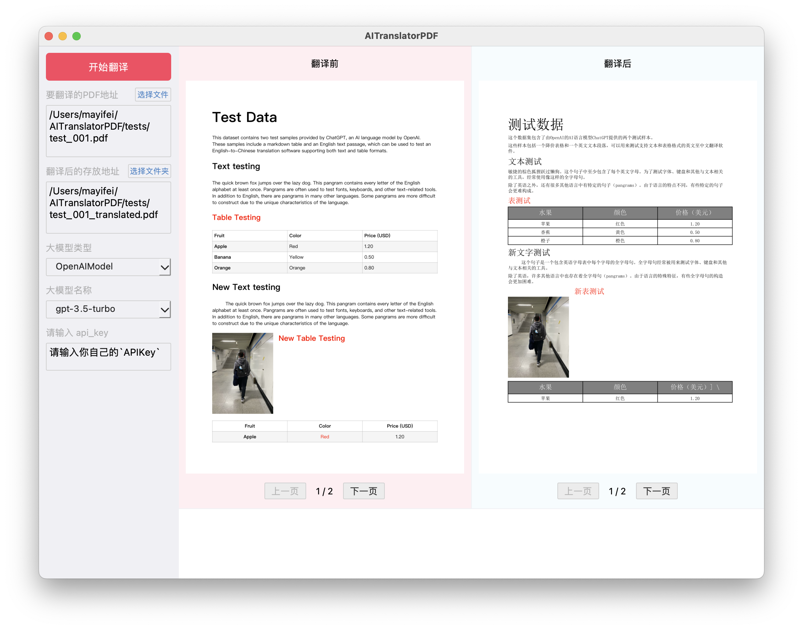

# AITranslatorPDF

## 运行GUI

#### 1.下载项目

```
git clone https://github.com/AntSnow/AITranslatorPDF.git
```

#### 2.进入项目

```
cd AITranslatorPDF
```


#### 3.创建虚拟环境（建议使用 Python3.9 版本）

```
# 指定版本创建（需要路径已安装对应版本）
/usr/local/bin/python3.9 -m venv myenv

# 正常创建
python -m venv myenv
```

#### 4.激活虚拟环境

```
# Windows
myenv\Scripts\activate

# macOS、Linux
source myenv/bin/activate

# 需要关闭虚拟环境时，可使用此命令
deactivate
```

#### 5.安装依赖包

```
# 使用 requirements 安装
pip install -r requirements.txt
```

#### 4.运行GUI（初次启动时，会有一些慢，不要着急哦）

```
python ai_translator/app.py
```


